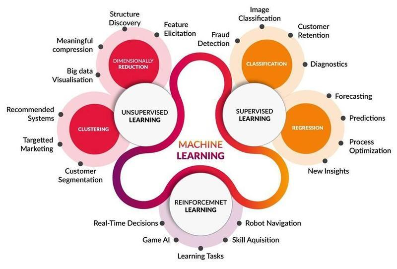

# Snippets and Cheat Sheets for Machine Learning

## ML Overview

Image source: http://www.cognub.com/index.php/cognitive-platform/

## Cheat Sheets

- Robbie Allen's [Cheat Sheet of Machine Learning and Python (and Math) Cheat Sheets](UnsupervisedMethods.com%20-%20Cheat%20Sheets/) compilation at [medium.com](https://medium.com/machine-learning-in-practice/cheat-sheet-of-machine-learning-and-python-and-math-cheat-sheets-a4afe4e791b6).
- Andrew Ng's [Notes](Deep%20Learning%20Coursera%20-%20Notes%20Andrew%20Ng/) compilation at [coursera.com](https://coursera.com).