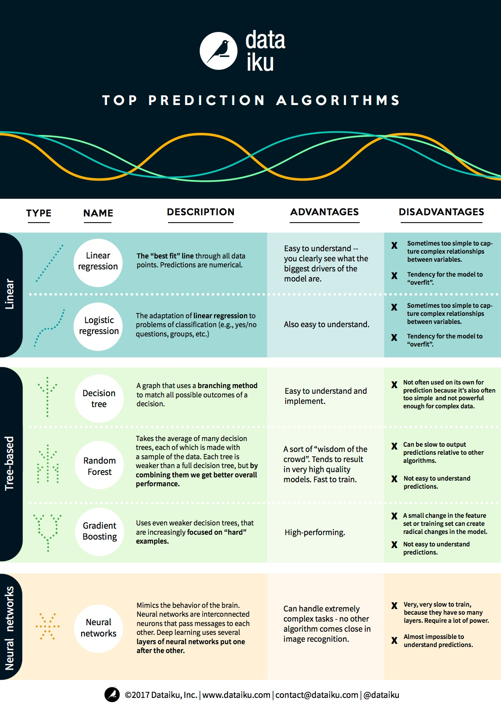

# Robbie Allen's [Cheat Sheet of Machine Learning and Python (and Math) Cheat Sheets](https://medium.com/machine-learning-in-practice/cheat-sheet-of-machine-learning-and-python-and-math-cheat-sheets-a4afe4e791b6)

## Math

- [Math-Calculus.pdf](Math-Calculus.pdf)
- [Math-Linear_Algebra.pdf](Math-Linear_Algebra.pdf)
- [Math-Probability.pdf](Math-Probability.pdf)
- [Math-Statistics_mit_csvoss.pdf](Math-Statistics_mit_csvoss.pdf)

## ML-Algorithms Categories

## ML-Algorithms Summary

## ML-Algorithms Summary

## ML-MS-Flow Chart

## ML-NeuralNetworks

## ML-SAS-Flow Chart

## Python-Algorithms

## Python-Basics

## Python-Basics2

## Python-Matplotlib

## Python-Numpy

## Python-Numpy2

## Python-Numpy3

## Python-Pandas

## Python-Pandas2

## Python-Scikit Learn

## Python-Scikit Learn Flowchart

## Jupyter Notebooks

- [Python-Numpy.ipynb](Python-Numpy.ipynb).
- [Python-Pandas.ipynb](Python-Pandas.ipynb).
- [Python-Tensorflow.ipynb](Python-Tensorflow.ipynb).
- [Python-Pytorch.ipynb](Python-Pytorch.ipynb).